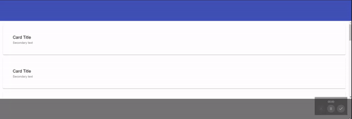
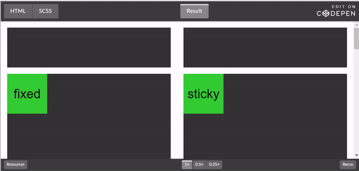

# Overview

As I can see it. When we need to to have 'sticky' header and/or footer, solution could vary depends on what we are trying to achieve.

## 1. Use document flow with only content scrollable

We can build HTML document flow that will contain of required 'sections' (in terms of UX) like: header, content and footer. Expand the whole document to 100% height and make sure that header is first element and next goes content that can grow (FlexBox or Grid) and eventually will move footer to the bottom.



**EXAMPLE** See [1-StickyTopBar-FlexBox.html](./1-StickyTopBar-FlexBox.html)

## Sticky or Fixed

There are few other options except natural document flow - position Sticky or Fixed. More details about differences could be found here [Kevin Powell - Position fixed vs position sticky](https://www.kevinpowell.co/article/positition-fixed-vs-sticky/)



Also read [Performance & Accessibility](https://developer.mozilla.org/en-US/docs/Web/CSS/position#Accessibility_concerns) notes from MDN.

As I can see it - the summary is the following
1. Sticky
  1.1 Required parent container withing what it will be Sticky
  1.2 From my point of view easier to integrate navigation menu as no need of paddings and z-index

2. Fixed
  2.1 Stay fixed in concrete position and does not require parent container
  2.2 Requires usage of `z-index`. I did not manage to find solutions without `z-index`. It would mean we need to set `z-index` when we are going to implement adaptive navigation menu

### 2. Use Position Sticky

Once `position: sticky` required parent container we will have to use something like this

```html
<body>
    <header></header>
    <main></main>
</body>
```

In this case `header` has parent container `body` and we can set
```css
position: sticky;
position:-webkit-sticky;
top:0;
```
**NOTE**: `position:-webkit-sticky;` is for iPhones


**EXAMPLE** See [2-StickyTopBar-Sticky.html](./2-StickyTopBar-Sticky.html)

### 3. Use Position Fixed


**EXAMPLE** See [3-StickyTopBar-Fixed.html](./3-StickyTopBar-Fixed.html)