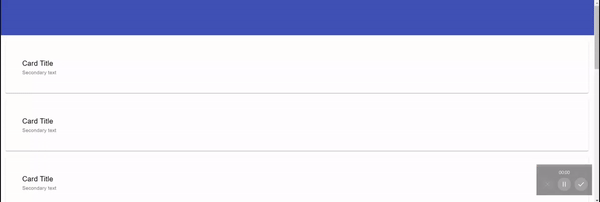

# Overview

As I can see it. When we need to to have 'sticky' header and/or footer, solution could vary depends on what we are trying to achieve.

# Headers

## 1. Use document flow with only content scrollable

As example used this video [FullStack Rant - Fixed header and footer with FlexBox](https://www.youtube.com/watch?v=cXIkalOFeaQ)

We can build HTML document flow that will contain of required 'sections' (in terms of UX) like: header, content and footer. Expand the whole document to 100% height and make sure that header is first element and next goes content that can grow (FlexBox or Grid) and eventually will move footer to the bottom.


**EXAMPLE** See [1-StickyTopBar-FlexBox.html](./1-StickyTopBar-FlexBox.html)

## 2. Sticky or Fixed

There are few other options except natural document flow - position Sticky or Fixed. More details about differences could be found here [Kevin Powell - Position fixed vs position sticky](https://www.kevinpowell.co/article/positition-fixed-vs-sticky/)


Also read [Performance & Accessibility](https://developer.mozilla.org/en-US/docs/Web/CSS/position#Accessibility_concerns) notes from MDN.

As I can see it - the summary is the following
1. Sticky
  1.1 Required parent container withing what it will be Sticky
  1.2 From my point of view easier to integrate navigation menu as no need of paddings and z-index

2. Fixed
  2.1 Stay fixed in concrete position and does not require parent container
  2.2 Requires usage of `z-index`. I did not manage to find solutions without `z-index`. It would mean we need to set `z-index` when we are going to implement adaptive navigation menu
  2.3 We also padding that depends on header hight e.g. if header hight changed we have some problems I guess

### 2.1. Use Position Sticky

As example used this video [smashtheshell - CSS Sticky Header - Fixed Navigation Menu Bar on Scroll using HTML5 and CSS3](https://www.youtube.com/watch?v=B4eISzWrcD4)

Main point that `position: sticky` required parent container and therefore we will have to use something like this

```html
<body>
    <header></header>
    <main></main>
</body>
```

In this case `header` has parent container `body` and we can set
```css
position: sticky;
position:-webkit-sticky;
top:0;
```
**NOTE**: `position:-webkit-sticky;` is for iPhones



**EXAMPLE** See [2-StickyTopBar-Sticky.html](./2-StickyTopBar-Sticky.html)

### 2.2. Use Position Fixed

As example used this video [Фрилансер по жизни - IT и фриланс - Правильное адаптивное меню бургер на HTML CSS и jQuery. Мобильное меню туториал - Как это сделать?](https://www.youtube.com/watch?v=chJQofBSx94)

```css
header {
  position: fixed;
  width: 100%;
  top: 0;
  left: 0;
  z-index: 50; // this is critical. on small screens we will use z-index on other elements
}
```

**EXAMPLE** See [3-StickyTopBar-Fixed.html](./3-StickyTopBar-Fixed.html)

# Sidebars

Please read articles from Heydon Pickering and Andy Bell on Side Bars [here in Every Layout Book](https://every-layout.dev/layouts/sidebar/).

## 1. Sidebar with Flex Box

Nothing special. Set Body to work as Flex container. Then set direction to Row.

**EXAMPLE** See [4-SideBar-FlexBox.html](./4-SideBar-FlexBox.html)

## 2. Expandable Sidebar 

As example used this video [Fireship - Animated Responsive Navbar with CSS - Plus Other Useful Tricks](https://www.youtube.com/watch?v=biOMz4puGt8)

**EXAMPLE** See [5-SideBar-Expandable.html](./5-SideBar-Expandable.html)